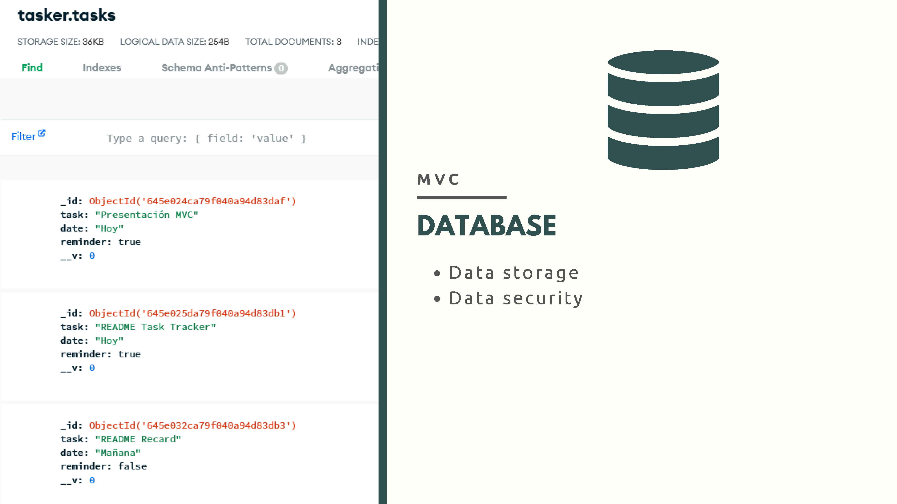

# MVC Overview: Model - View - Controller Architecture

### Watch the video version of this lecture [here](https://youtu.be/SIHGbcEUIAU).

Hello, I’m Borja Martí, and today I want to introduce you to the concept of MVC. For that, I will explain the basics of this concept as it applies specifically to web development.

MVC stands for Model / View / Controller, and it’s a software architecture paradigm that helps structure our applications by separating the business logic (or data) from the presentation layer (or user interface).

So, why is it useful? And why should we implement it in our work?

The main reason is separation of concerns: MVC provides a clear separation between the components of our application (Model, View, and Controller), resulting in better code organization.

Separating our components has a few advantages. The main ones are:

1-    Modularity and reusability: Because we develop each component independently, we can reuse, for example, a Model across different Views, or vice-versa.

2-    And Readability and maintainability: It’s also easier to understand and modify individual parts of the application, especially when we are working in teams.

Okay, let’s take a closer look at how these components interact with each other and delve deeper into their functions.

Here we have an overview of the pattern in action for a server-side front end, full-stack application. Our browser communicates with the server via requests, which are directed by the router and passed to the controller. The Controller acts as a mediator between the Model and View components. If data from the database is required, the Controller passes the request to the Model, which handles data access and retrieves the necessary data. Finally, the Views, generated on the server, are sent to the client to display this data.

Now that we understand the process, let's examine each component individually:

First, we have the browser. This software application allows users to interact with the web. It sends requests to our servers, handles responses, and displays content to the user. Its role may vary depending on whether our application is client-side or server-side.

When a user sends a request to our server, the router parses it and directs it to the appropriate handler or controller based on the route and method.

The Controller receives the request and performs any relevant operations. It often interacts with the Model to retrieve or modify data from the Data Base, and then pass it to the Views component to be displayed to the user. Web frameworks like Express.js can be used to handle requests efficiently.

Our database stores and secures our data. Choosing between a relational or non-relational database depends on the application's needs. Examples include PostgreSQL for relational databases and MongoDB for non-relational databases.

As we said, the Model handles data access, allowing structured interaction with the database, and ensuring data integrity and consistency. For instance, Mongoose, used in conjunction with MongoDB, provides an Object Data Model to create structured models from schemas. It also offers specific methods for querying, modifying, and retrieving data.

Finally, we have the View component, which presents the business logic to the user in a meaningful way. It renders the user interface, enabling user interaction with our application. Views can be handled on the client side (e.g., React) or the server side (e.g., Handlebars). With tools like Next.js, we can even combine client-side views with server-side views using React.

Now, let's consider how these components interact in a client-side front-end web application.

When the user accesses our site with their browser, the server loads the front end of our application responsible for the Views in the client. User interactions with the view trigger requests that pass through the server as before. The router directs them to the appropriate Controller part, which handles the requests, and the Model grabs or modifies any needed data from the database. Finally, this data is returned to the client, which uses it to update the View.

And that’s the essence of MVC. It’s a software design pattern that separates our code base by function, making maintenance and component reusability easier.

I find it incredibly useful, as it allows me to quickly start projects by knowing which parts I need and having the option to reuse components from previous projects.

I hope this brief overview has been helpful.

Cheers!